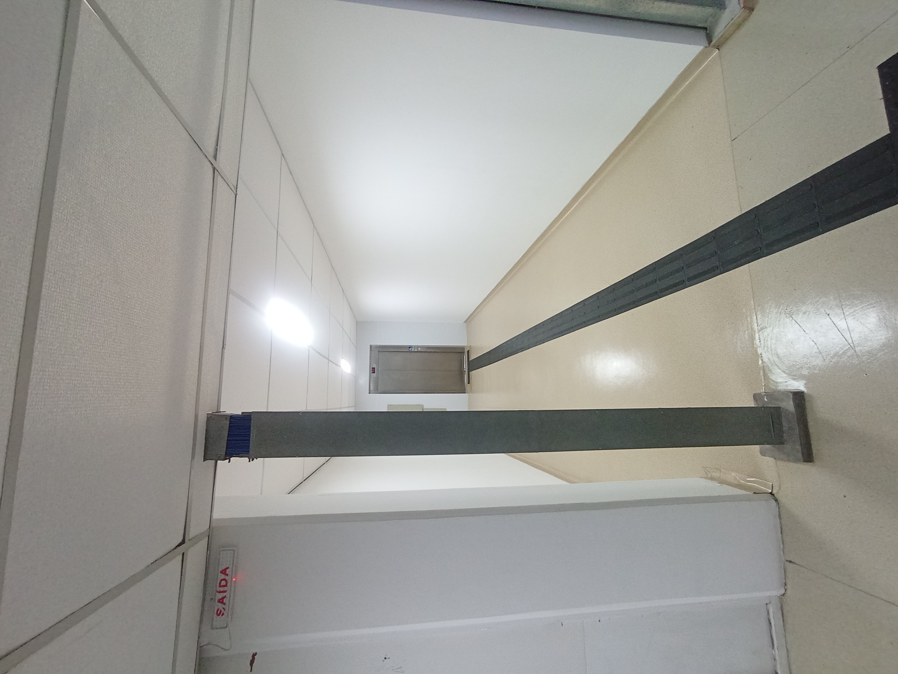
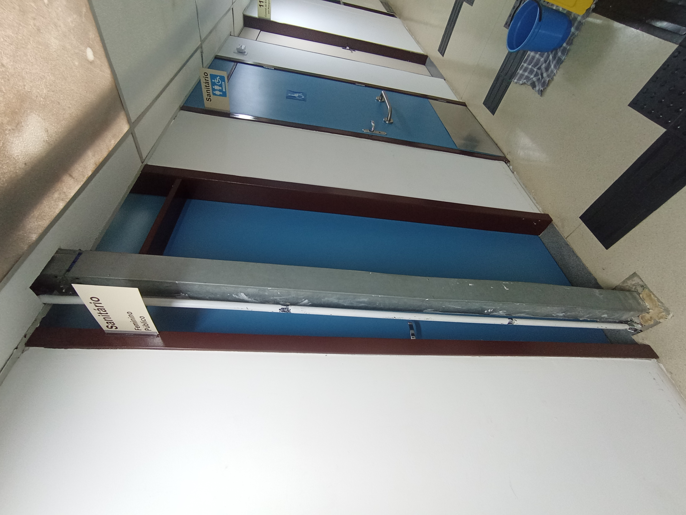

### Anexo A: Justificativa

O [Edital CN 03/2023 da Superintendência do Espaço Físico (SEF/USP)](https://www.sef.usp.br/wp-content/uploads/sites/52/2023/06/CN-03-2023-Edital.pdf), referente à requisição Mercúrio nº 202300316143 (*Execução de reforma para acessibilidade do Edifício da Administração da Faculdade de Filosofia, Letras e Ciências Humanas da USP*), contemplou intervenções de acessibilidade no prédio da Administração da FFLCH.

Durante a execução da obra, o elevador de acessibilidade foi instalado exatamente em frente à eletrocalha que comporta o cabeamento de rede do 1º pavimento para o térreo, onde se localiza a Sala Técnica 1 (TR1), conforme ilustrado na **Foto 1**.

Ademais, o banheiro adaptado, reformado na mesma intervenção, também foi construído exatamente em frente à eletrocalha responsável pelo cabeamento de rede do 1º pavimento para o térreo com destino à Sala Técnica 2 (TR2), conforme demonstrado na **Foto 2**.

<table style="width: 100%; border-collapse: collapse; border: none; margin: 20px 0;">
  <tr>
    <td style="width: 50%; padding: 6px; border: none; text-align: center; vertical-align: top;">
      
       <strong>Foto 1:</strong> Elevador instalado em frente à eletrocalha (TR1).
    </td>
    <td style="width: 50%; padding: 6px; border: none; text-align: center; vertical-align: top;">
      
       <strong>Foto 2:</strong> Banheiro adaptado construído em frente à eletrocalha (TR2).
    </td>
  </tr>
</table>

### Anexo B: Empresas Consultadas

Solicitação de orçamento enviada às empresas listadas abaixo, selecionadas a partir do termo de busca no Google: `"cabeamento estruturado and são paulo and empresa"`. [Email enviado em 04/09/2026](../../assets/2026/obra-cabeamento-adm/email1.pdf).

<table style="width: 100%; border-collapse: collapse; margin: 20px 0; font-family: -apple-system, BlinkMacSystemFont, 'Segoe UI', Roboto, Helvetica, Arial, sans-serif; font-size: 14px; box-shadow: 0 2px 6px rgba(0,0,0,0.08); border-radius: 8px; overflow: hidden; border: 1px solid #e2e8f0;">
  <thead>
    <tr style="background-color: #1e293b; color: #ffffff; text-align: left;">
      <th style="padding: 12px 16px; font-weight: 600; border-bottom: 2px solid #0f172a;">Nome da Empresa</th>
      <th style="padding: 12px 16px; font-weight: 600; border-bottom: 2px solid #0f172a;">E-mail de Contato</th>
    </tr>
  </thead>
  <tbody>
    <tr style="background-color: #ffffff;">
      <td style="padding: 10px 16px; border-bottom: 1px solid #e2e8f0; font-weight: 500; color: #0f172a;">AGT Infraestrutura</td>
      <td style="padding: 10px 16px; border-bottom: 1px solid #e2e8f0;"><a href="mailto:contato@agtinfraestrutura.com.br" style="color: #2563eb; text-decoration: none;">contato@agtinfraestrutura.com.br</a></td>
    </tr>
    <tr style="background-color: #f8fafc;">
      <td style="padding: 10px 16px; border-bottom: 1px solid #e2e8f0; font-weight: 500; color: #0f172a;">DRJ Engenharia</td>
      <td style="padding: 10px 16px; border-bottom: 1px solid #e2e8f0;"><a href="mailto:contato@drjengenharia.com.br" style="color: #2563eb; text-decoration: none;">contato@drjengenharia.com.br</a></td>
    </tr>
    <tr style="background-color: #ffffff;">
      <td style="padding: 10px 16px; border-bottom: 1px solid #e2e8f0; font-weight: 500; color: #0f172a;">Eight TI</td>
      <td style="padding: 10px 16px; border-bottom: 1px solid #e2e8f0;"><a href="mailto:contato@eightti.com.br" style="color: #2563eb; text-decoration: none;">contato@eightti.com.br</a></td>
    </tr>
    <tr style="background-color: #f8fafc;">
      <td style="padding: 10px 16px; border-bottom: 1px solid #e2e8f0; font-weight: 500; color: #0f172a;">Grupo Smartseg</td>
      <td style="padding: 10px 16px; border-bottom: 1px solid #e2e8f0;"><a href="mailto:vendas@gruposmartseg.com.br" style="color: #2563eb; text-decoration: none;">vendas@gruposmartseg.com.br</a></td>
    </tr>
    <tr style="background-color: #ffffff;">
      <td style="padding: 10px 16px; border-bottom: 1px solid #e2e8f0; font-weight: 500; color: #0f172a;">Grupo V3 Connect</td>
      <td style="padding: 10px 16px; border-bottom: 1px solid #e2e8f0;"><a href="mailto:contato@grupov3connect.com.br" style="color: #2563eb; text-decoration: none;">contato@grupov3connect.com.br</a></td>
    </tr>
    <tr style="background-color: #f8fafc;">
      <td style="padding: 10px 16px; border-bottom: 1px solid #e2e8f0; font-weight: 500; color: #0f172a;">High Tech Solutions</td>
      <td style="padding: 10px 16px; border-bottom: 1px solid #e2e8f0;"><a href="mailto:marcio.parra@hightechsolutions.com.br" style="color: #2563eb; text-decoration: none;">marcio.parra@hightechsolutions.com.br</a></td>
    </tr>
    <tr style="background-color: #ffffff;">
      <td style="padding: 10px 16px; border-bottom: 1px solid #e2e8f0; font-weight: 500; color: #0f172a;">HM Telecom</td>
      <td style="padding: 10px 16px; border-bottom: 1px solid #e2e8f0;"><a href="mailto:comercial@hmtelecom.com.br" style="color: #2563eb; text-decoration: none;">comercial@hmtelecom.com.br</a></td>
    </tr>
    <tr style="background-color: #f8fafc;">
      <td style="padding: 10px 16px; border-bottom: 1px solid #e2e8f0; font-weight: 500; color: #0f172a;">Lofty</td>
      <td style="padding: 10px 16px; border-bottom: 1px solid #e2e8f0;"><a href="mailto:willerson@grupolofy.com.br" style="color: #2563eb; text-decoration: none;">willerson@grupolofy.com.br</a></td>
    </tr>
    <tr style="background-color: #ffffff;">
      <td style="padding: 10px 16px; border-bottom: 1px solid #e2e8f0; font-weight: 500; color: #0f172a;">M&amp;N Engenharia</td>
      <td style="padding: 10px 16px; border-bottom: 1px solid #e2e8f0;"><a href="mailto:nelsonmaster.mn@gmail.com" style="color: #2563eb; text-decoration: none;">nelsonmaster.mn@gmail.com</a></td>
    </tr>
    <tr style="background-color: #f8fafc;">
      <td style="padding: 10px 16px; border-bottom: 1px solid #e2e8f0; font-weight: 500; color: #0f172a;">Net Clear</td>
      <td style="padding: 10px 16px; border-bottom: 1px solid #e2e8f0;"><a href="mailto:joseroberto@netclear.com.br" style="color: #2563eb; text-decoration: none;">joseroberto@netclear.com.br</a></td>
    </tr>
    <tr style="background-color: #ffffff;">
      <td style="padding: 10px 16px; border-bottom: 1px solid #e2e8f0; font-weight: 500; color: #0f172a;">Net Telecom</td>
      <td style="padding: 10px 16px; border-bottom: 1px solid #e2e8f0;"><a href="mailto:deivid.silva@nettelecom.com.br" style="color: #2563eb; text-decoration: none;">deivid.silva@nettelecom.com.br</a></td>
    </tr>
    <tr style="background-color: #f8fafc;">
      <td style="padding: 10px 16px; border-bottom: 1px solid #e2e8f0; font-weight: 500; color: #0f172a;">NewCon</td>
      <td style="padding: 10px 16px; border-bottom: 1px solid #e2e8f0;"><a href="mailto:silvia.thomaz@newcon-br.com" style="color: #2563eb; text-decoration: none;">silvia.thomaz@newcon-br.com</a></td>
    </tr>
    <tr style="background-color: #ffffff;">
      <td style="padding: 10px 16px; border-bottom: 1px solid #e2e8f0; font-weight: 500; color: #0f172a;">Redson</td>
      <td style="padding: 10px 16px; border-bottom: 1px solid #e2e8f0;"><a href="mailto:redson.ltda@redson.com.br" style="color: #2563eb; text-decoration: none;">redson.ltda@redson.com.br</a></td>
    </tr>
    <tr style="background-color: #f8fafc;">
      <td style="padding: 10px 16px; border-bottom: 1px solid #e2e8f0; font-weight: 500; color: #0f172a;">Rema Tecnologia</td>
      <td style="padding: 10px 16px; border-bottom: 1px solid #e2e8f0;"><a href="mailto:rema.tecnologia@gmail.com" style="color: #2563eb; text-decoration: none;">rema.tecnologia@gmail.com</a></td>
    </tr>
    <tr style="background-color: #ffffff;">
      <td style="padding: 10px 16px; border-bottom: 1px solid #e2e8f0; font-weight: 500; color: #0f172a;">Rstelecom</td>
      <td style="padding: 10px 16px; border-bottom: 1px solid #e2e8f0;"><a href="mailto:rstelecom1@rstelecom1.com.br" style="color: #2563eb; text-decoration: none;">rstelecom1@rstelecom1.com.br</a></td>
    </tr>
    <tr style="background-color: #f8fafc;">
      <td style="padding: 10px 16px; border-bottom: 1px solid #e2e8f0; font-weight: 500; color: #0f172a;">RSX Telecom</td>
      <td style="padding: 10px 16px; border-bottom: 1px solid #e2e8f0;"><a href="mailto:comercial.rsxtelecom@gmail.com" style="color: #2563eb; text-decoration: none;">comercial.rsxtelecom@gmail.com</a></td>
    </tr>
    <tr style="background-color: #ffffff;">
      <td style="padding: 10px 16px; border-bottom: 1px solid #e2e8f0; font-weight: 500; color: #0f172a;">Teleiza</td>
      <td style="padding: 10px 16px; border-bottom: 1px solid #e2e8f0;"><a href="mailto:teleiza@teleiza.com.br" style="color: #2563eb; text-decoration: none;">teleiza@teleiza.com.br</a></td>
    </tr>
    <tr style="background-color: #f8fafc;">
      <td style="padding: 10px 16px; border-bottom: 1px solid #e2e8f0; font-weight: 500; color: #0f172a;">Tree Systems</td>
      <td style="padding: 10px 16px; border-bottom: 1px solid #e2e8f0;"><a href="mailto:pronaldo@treesystems.com.br" style="color: #2563eb; text-decoration: none;">pronaldo@treesystems.com.br</a></td>
    </tr>
    <tr style="background-color: #ffffff;">
      <td style="padding: 10px 16px; border-bottom: 1px solid #e2e8f0; font-weight: 500; color: #0f172a;">Valtec Soluções</td>
      <td style="padding: 10px 16px; border-bottom: 1px solid #e2e8f0;"><a href="mailto:gilson.silva@valtecsolucoes.com.br" style="color: #2563eb; text-decoration: none;">gilson.silva@valtecsolucoes.com.br</a></td>
    </tr>
  </tbody>
</table>

