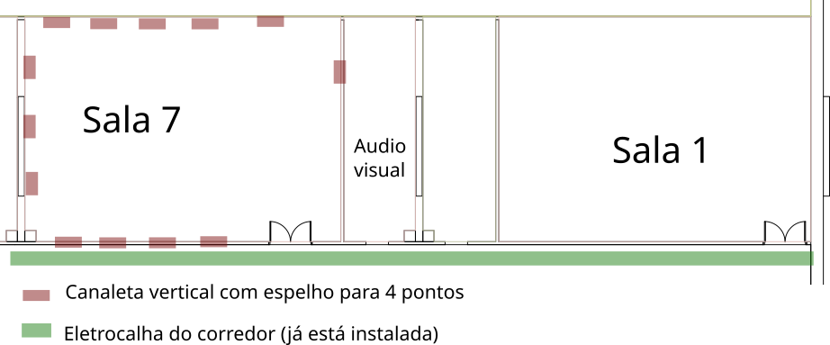

A localização da sala favorece a execução do cabeamento em curto prazo, pois a área está adjacentemente ligada à eletrocalha principal, conforme indicado na imagem abaixo.

Considerando a configuração da sala, é necessário instalar canaletas para a descida dos pontos de rede, de modo a viabilizar a distribuição do cabeamento estruturado até as posições de trabalho e ao ponto docente. A marcação na planta foi definida para orientar a execução das descidas e a logística da obra.

A intervenção prevista contempla a abertura do chamado de manutenção [https://atendimento.fflch.usp.br/chamados/13285](https://atendimento.fflch.usp.br/chamados/13285), com o objetivo de estruturar a passagem dos cabos e compatibilizar a obra com os serviços existentes. A solução proposta considera a disponibilidade de material para o cabeamento de rede, enquanto a definição de mesas e mobiliário permanecerá alinhada às necessidades de uso da sala e às condições do ambiente.

Com o esquema desenvolvido na planta, cada canaleta atende a 4 pontos de rede. Assim, com 12 canaletas, será possível disponibilizar 48 pontos de conexão, atendendo a demanda de computadores da sala. Também foi prevista a canaleta para a posição do docente, e o equipamento de projeção será providenciado pelo setor responsável.
